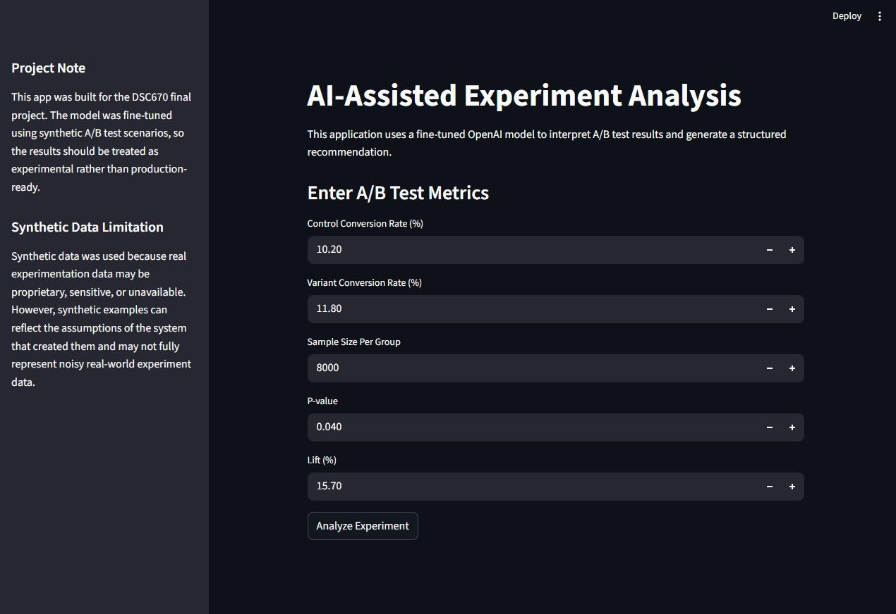
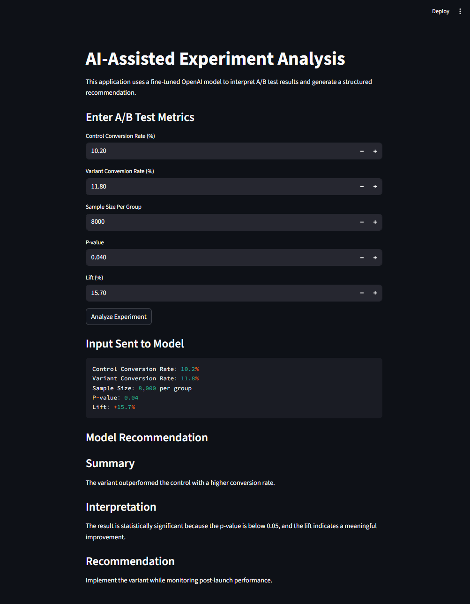
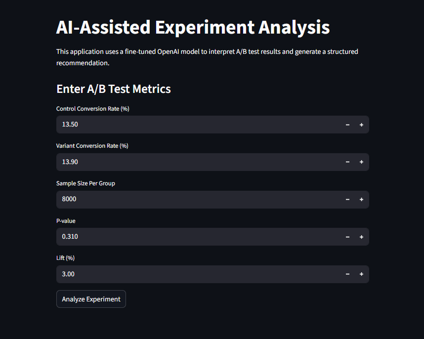
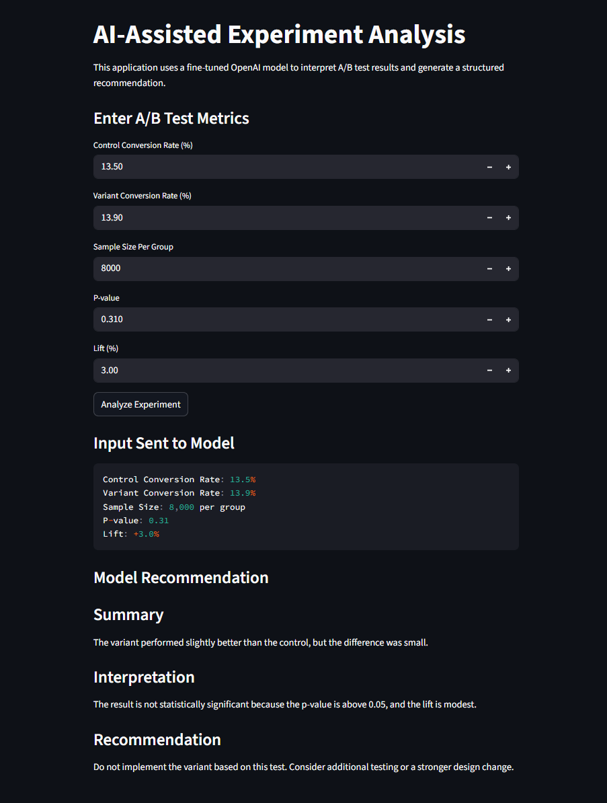

# AI-Assisted Experiment Analysis

## Overview
This project explores how a fine-tuned generative AI model can assist with interpreting A/B test results and generating structured experiment recommendations. The solution combines prompt engineering, OpenAI fine-tuning, synthetic experimentation data, and a Streamlit web application.

The goal was not to replace human analysis, but to evaluate how generative AI could support consistency, formatting, and interpretation workflows for digital experimentation use cases.

## Problem
A/B test results often need to be translated into clear business-facing summaries, interpretations, and recommendations. This process can be repetitive, especially when analysts are reviewing similar result patterns across many experiments.

This project investigates whether a fine-tuned model can help generate structured analysis from user-entered experiment metrics while still preserving the need for human oversight.

## Project Features
- Interactive Streamlit web application
- User-entered A/B test metrics
- Structured output with Summary, Interpretation, and Recommendation sections
- Fine-tuned OpenAI model integration
- Synthetic training examples for experimentation analysis scenarios
- Human oversight and synthetic data limitation messaging built into the app

## Tools and Technologies
- Python
- Streamlit
- OpenAI API
- OpenAI Fine-Tuning
- JSONL training datasets
- Prompt engineering

## Fine-Tuning Workflow
The project used synthetic experimentation examples to prepare JSONL training data for OpenAI fine-tuning. Initial attempts surfaced practical implementation issues, including validation file formatting errors and insufficient training example count.

The training dataset was expanded from 5 examples to 12 examples before successfully completing fine-tuning.

Fine-tuned model:
`ft:gpt-4o-mini-2024-07-18:personal:experiment-analysis-v3:DbSPQHKQ`

## Key Findings
Prompt engineering alone produced strong baseline results for structured experiment interpretation. Fine-tuning improved response consistency, structure, and formatting more than it improved core reasoning capability.

The project also showed that fine-tuning workflows require careful dataset formatting, validation, and iteration. Synthetic data was useful for controlled experimentation but introduced limitations because it may not fully reflect the complexity of real production experiment results.

## Limitations
- Training examples were synthetic rather than drawn from real experimentation history
- The model output still requires human review before business use
- Fine-tuning improved structure and consistency, but should not be treated as independent statistical validation
- The project was designed as an applied prototype rather than a production decision system

## Repository Contents
- Streamlit application file (`app.py`)
- Fine-tuning dataset files
- Screenshots of the running application
- Supporting project documentation

## Application Screenshots

### Significant Test Scenario
Main application interface using statistically significant experiment results.

Generated structured AI-assisted recommendation output.

---

### Non-Significant Test Scenario
Main application interface using a non-significant experiment result.

Generated recommendation demonstrating cautious interpretation and non-deployment guidance.

## Course Context
Bellevue University  
DSC670 - Advanced Uses of Generative AI
